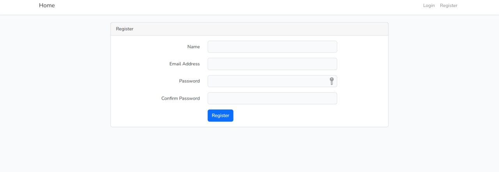
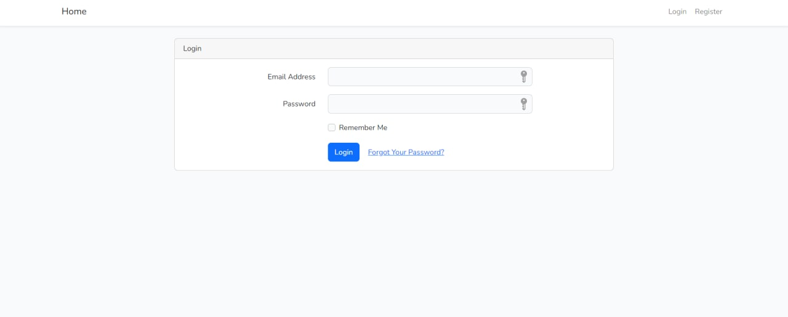
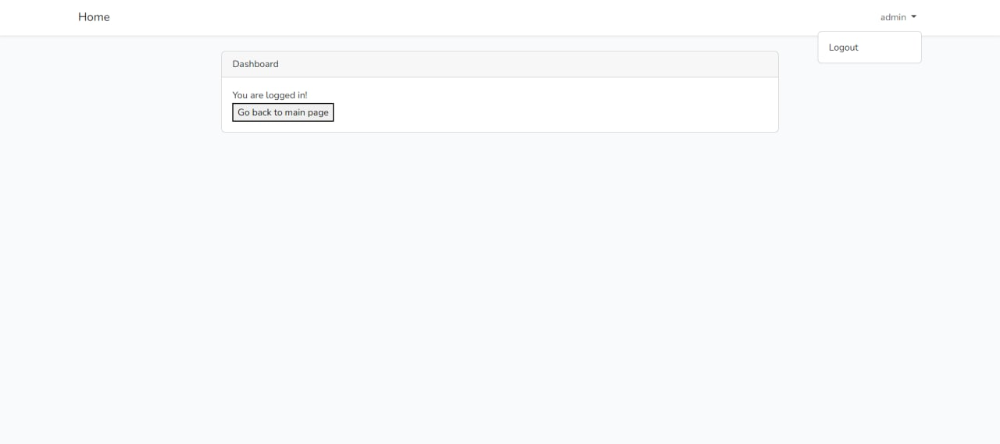
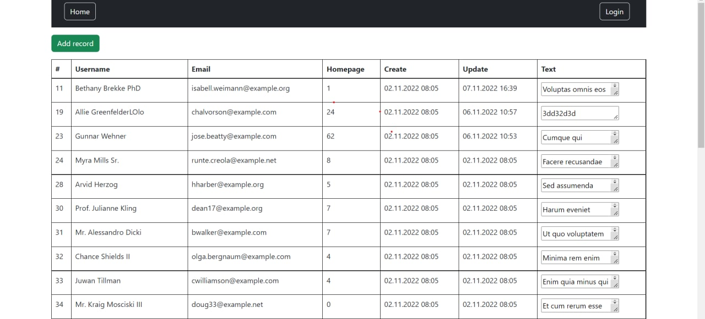
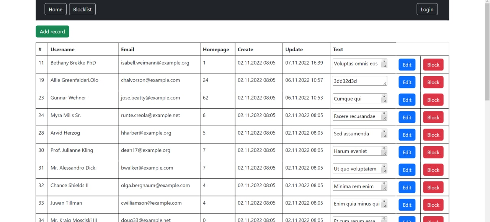
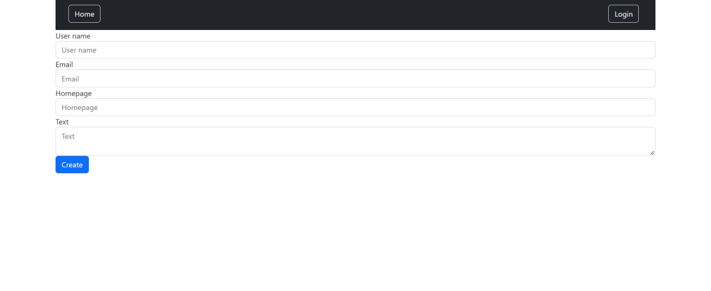
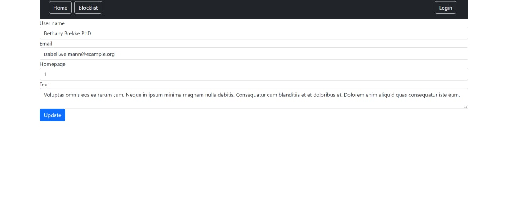
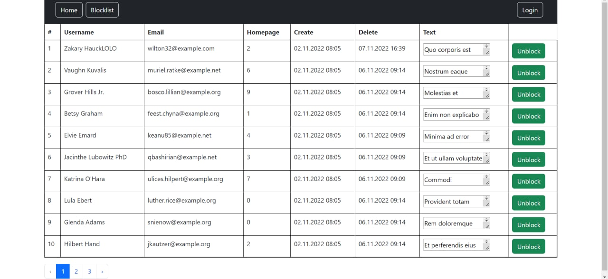

# Гостевая книга
<hr>
Позволяет добавлять жалобы на сайт. Доступен просмотре всех записей для не авторизованных пользователей. Для авторизованных пользователей доступно редактирование и бан записей. Из снятых с публикации записей формируется отдельная список, который можно просмотреть и разблокировать записи.
<hr>

### Как запустить проект

Выполнить миграции

```
php artisan migrate
```

Установить необходимые пакеты

```
npm install
```

Запустить сервер

```
php artisan serve
```

<hr>

### Screechshots

Форма регистрации


Форма авторизации


Кабинет авторизованного пользователя


Страница с записями


Страница с записями для админа


Добавление записи


Редактирование записи


Страница с заблокированными записями

